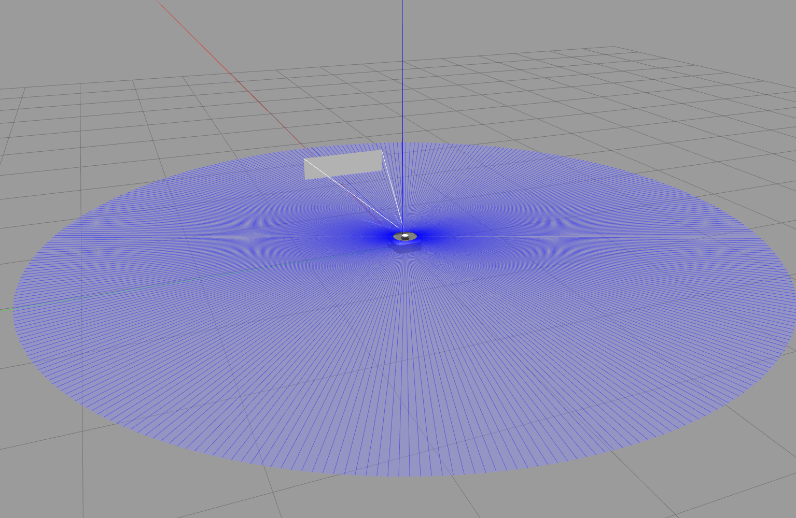
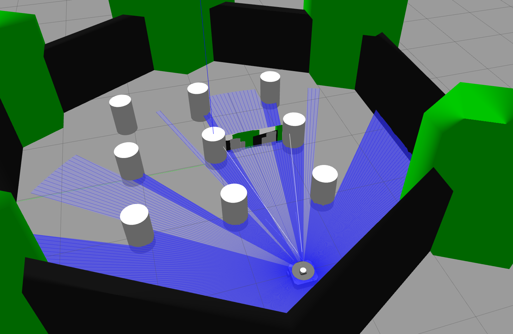
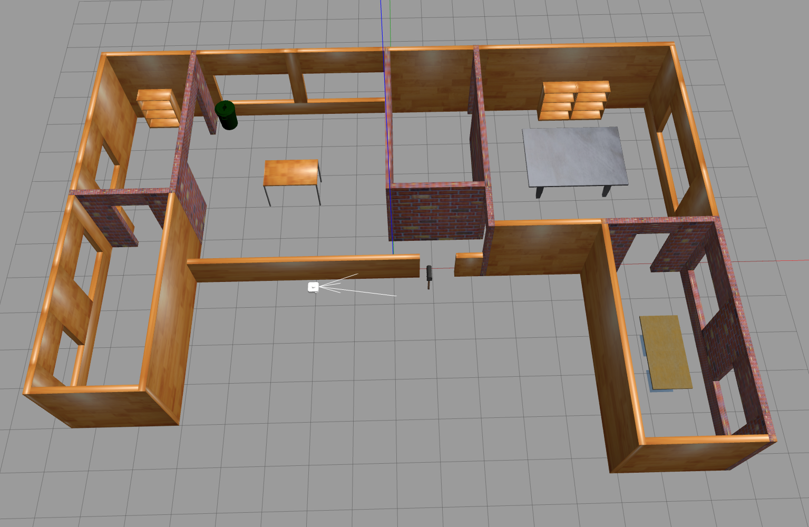
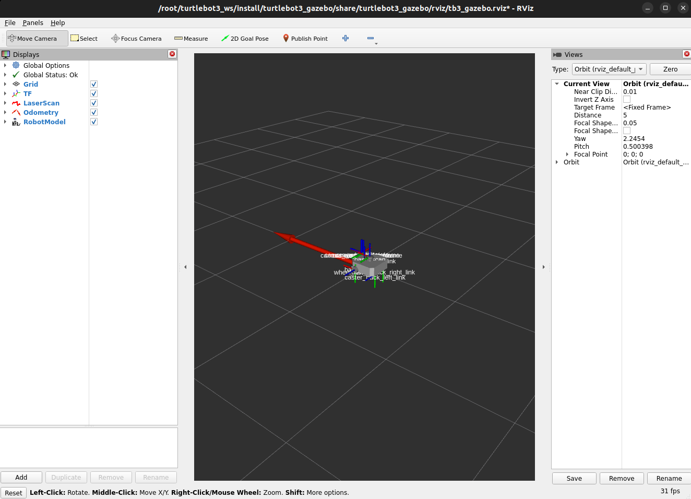
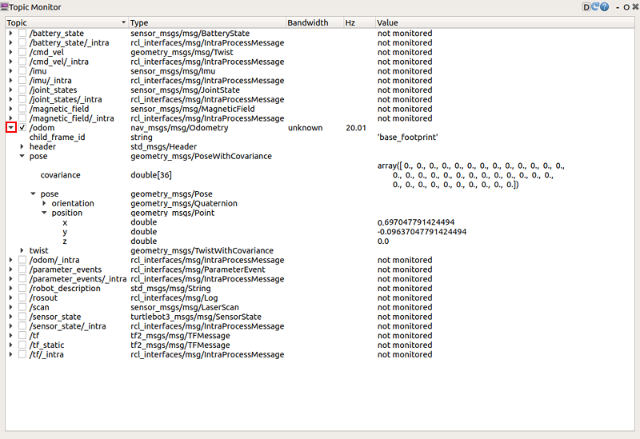
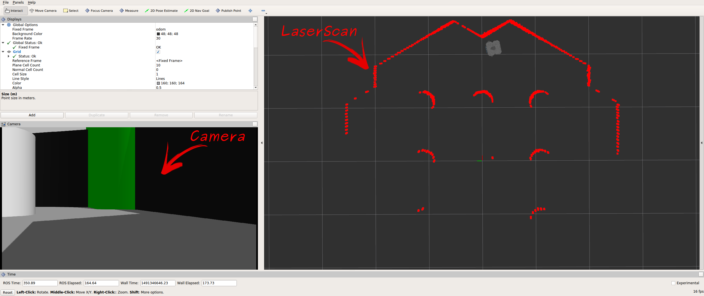

# 🏎️ Simulação do TurtleBot3 no ROS2

Este tutorial aborda como rodar simulações do **TurtleBot3** no **Gazebo** e utilizar a simulação com **Fake Node** dentro do **container Docker**. Além disso, veremos como monitorar os tópicos do ROS2.

> **Importante:** Todos os passos aqui devem ser executados dentro do **container Docker**.

---

## 📦 1️⃣ Configuração Inicial

### **Passo 1: Iniciar o Container**
Se ainda não estiver rodando, inicie o container:
```bash
./run.sh turtlebot3_ros2:latest
```
Caso precise abrir um novo terminal dentro do container:
```bash
docker exec -it turtlebot3_container bash
```

### **Passo 2: Configuração do Modelo do TurtleBot3**
O modelo padrão no container é **`waffle`**, mas você pode alterá-lo dentro do container executando:
```bash
export TURTLEBOT3_MODEL=burger  # Opções: burger, waffle, waffle_pi
```

Se quiser manter a alteração de forma persistente:
```bash
echo "export TURTLEBOT3_MODEL=burger" >> ~/.bashrc
source ~/.bashrc
```

---

## 🎮 2️⃣ Simulação no Gazebo

No ROS2, podemos rodar diferentes cenários no **Gazebo** com o **TurtleBot3**. Todos os comandos a seguir devem ser executados **dentro do container**.

### **Opção 1: Mundo Vazio (`empty_world`)**
Este ambiente contém apenas um plano básico, útil para testes iniciais.

```bash
ros2 launch turtlebot3_gazebo empty_world.launch.py
```



### **Opção 2: Mundo Padrão (`turtlebot3_world`)**
Este é o ambiente de simulação principal, com obstáculos e estruturas.

```bash
ros2 launch turtlebot3_gazebo turtlebot3_world.launch.py
```



### **Opção 3: Mundo Casa (`turtlebot3_house`)**
Esse ambiente simula uma casa com salas e corredores.

```bash
ros2 launch turtlebot3_gazebo turtlebot3_house.launch.py
```



> **Nota:** Se for a **primeira vez** rodando `turtlebot3_house`, o download do mapa pode levar alguns minutos, dependendo da velocidade da rede.


---

## 🤖 3️⃣ Simulação com Fake Node (Sem Gazebo)

Se não quiser rodar o **Gazebo**, podemos simular apenas os sensores do TurtleBot3 usando o **Fake Node**.

### **Rodar o Fake Node**
```bash
ros2 launch turtlebot3_fake_node turtlebot3_fake_node.launch.py
```

Esse comando inicia uma simulação simplificada do TurtleBot3 sem gráficos.



## 📊 4️⃣ Monitoramento de Tópicos

O ROS2 permite monitorar os tópicos do sistema em tempo real, seja via **linha de comando** ou **interface gráfica**.

### **Opção 1: Linha de Comando**
#### **Listar Tópicos**
```bash
ros2 topic list
```

#### **Inspecionar Mensagens de um Tópico**
```bash
ros2 topic echo /scan
```

#### **Ver Tipo de Mensagem de um Tópico**
```bash
ros2 topic info /cmd_vel
```

---

### **Opção 2: Monitoramento Visual com `rqt`**
O `rqt` é uma interface gráfica que facilita o monitoramento dos tópicos do ROS2.

#### **Passo 1: Instalar o `rqt` (se necessário)**
Caso o `rqt` não esteja instalado no seu ambiente dentro do container, execute:
```bash
apt update && apt install -y ros-humble-rqt ros-humble-rqt-common-plugins
```

#### **Passo 2: Iniciar o `rqt`**
Execute dentro do **container**:
```bash
rqt
```

Se a janela do **Topic Monitor** não aparecer automaticamente, vá em:
```
Plugins → Topics → Topic Monitor
```
Isso abrirá uma interface listando todos os tópicos do ROS2, como mostrado abaixo:



#### **Passo 3: Ativar o Monitoramento**
Os tópicos não são monitorados por padrão. Para visualizar as mensagens, **marque a caixa de seleção** ao lado de cada tópico que deseja monitorar.

Aqui está a **seção atualizada** do tutorial **`03-simulation`**, agora incluindo a visualização no **RViz2**:

---

## 🖥️ 5️⃣ Visualização de Dados no RViz2

O **RViz2** é uma ferramenta gráfica para visualizar os dados da simulação, como imagens de câmeras e leituras do **LaserScan**.

### **Passo 1: Iniciar o RViz2**
Com a simulação rodando, abra um novo terminal no **container** e execute:
```bash
ros2 launch turtlebot3_bringup rviz2.launch.py
```

Isso iniciará a interface do **RViz2**, permitindo visualizar os sensores do robô em tempo real.



### **Passo 2: Adicionar Plugins no RViz2**
Se os dados do **LaserScan** ou da **Câmera** não aparecerem automaticamente:
1. Vá em `Panels → Add New Panel`.
2. Selecione `LaserScan` para visualizar o LiDAR.
3. Selecione `Camera` para visualizar a câmera embutida do TurtleBot3.
4. Ajuste os parâmetros conforme necessário.

---

## 📚 Referências

- [TurtleBot3 - Gazebo Simulation](https://emanual.robotis.com/docs/en/platform/turtlebot3/simulation/#gazebo-simulation)
- [TurtleBot3 - Fake Node Simulation](https://emanual.robotis.com/docs/en/platform/turtlebot3/fakenode_simulation/)
- [TurtleBot3 - Topic Monitoring](https://emanual.robotis.com/docs/en/platform/turtlebot3/basic_operation/#topic-monitor)

---
