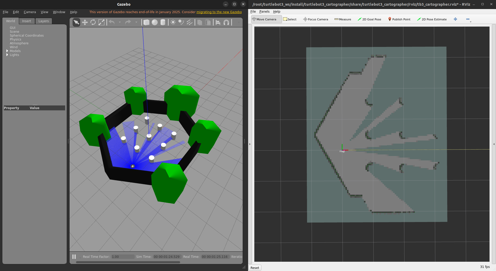
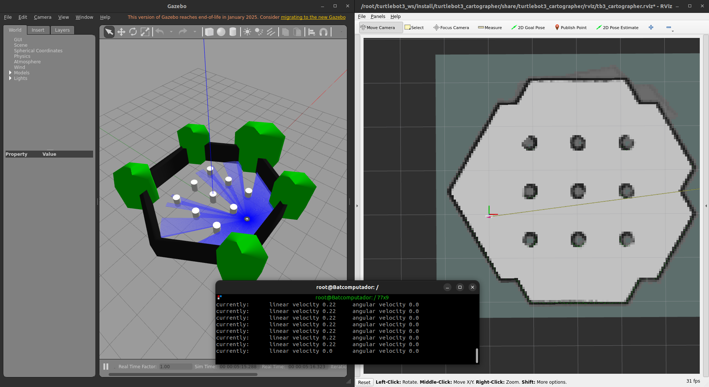
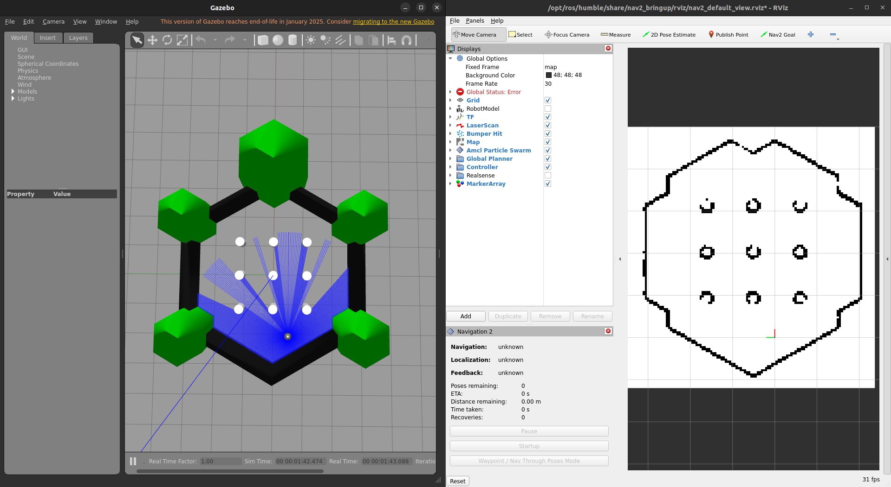
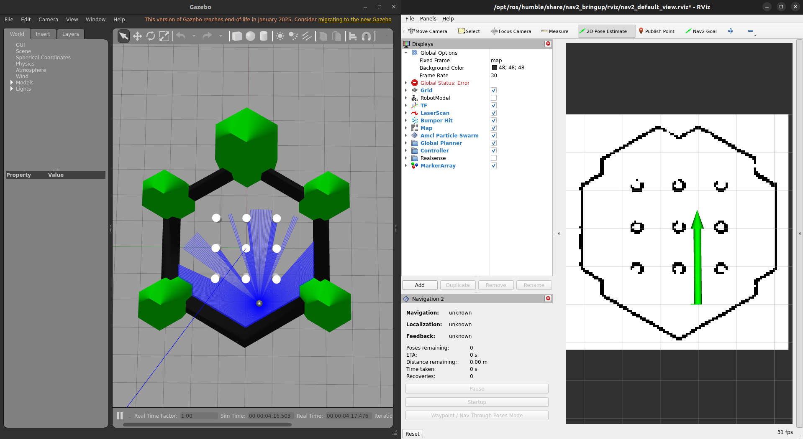
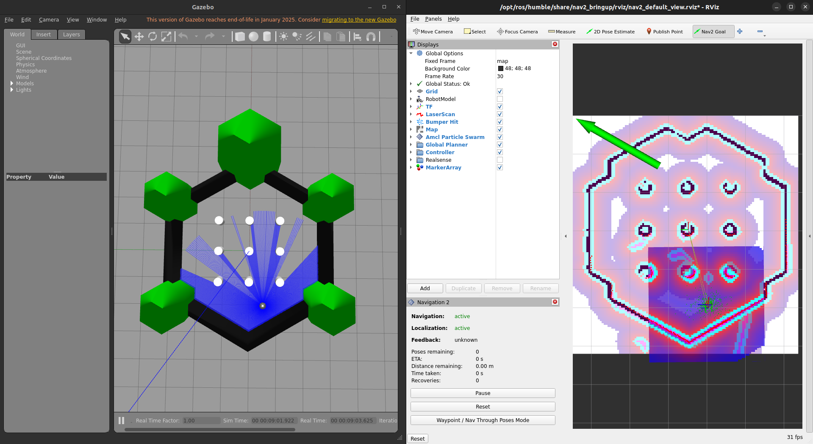
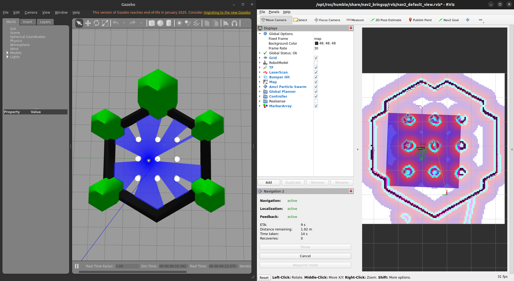
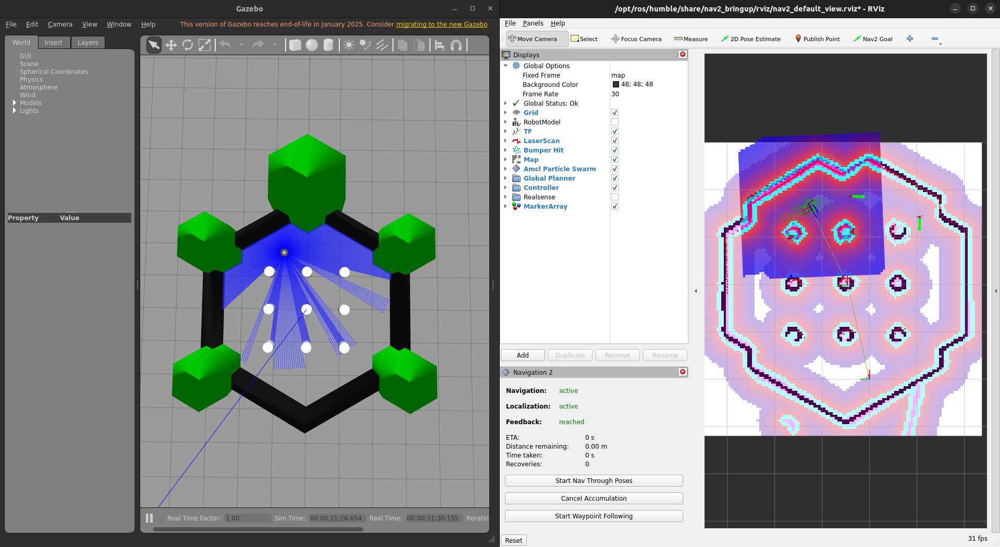
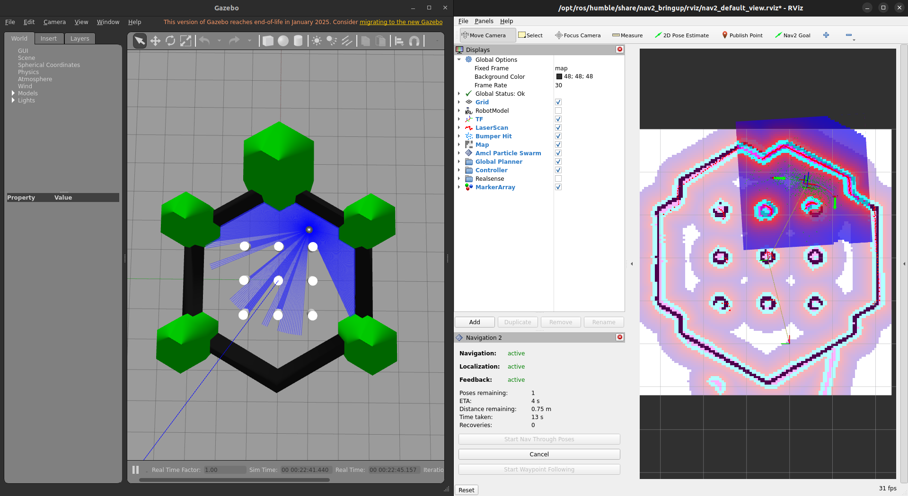

# 🤖 Localização, Mapeamento e Navegação do TurtleBot3 

Este tutorial ensina como **Mapear um ambiente** com o **TurtleBot3** utilizando os pacotes de SLAM e navigation do **Turtlebot3**.

> **Importante:** Todos os comandos devem ser executados **dentro do container Docker**.
---

## 📦 1️⃣ Configuração Inicial

### **Passo 1: Iniciar o Container**
Caso ainda não esteja rodando:
```bash
./run.sh turtlebot3_ros2:latest
```
Caso precise abrir um novo terminal dentro do container:
```bash
docker exec -it turtlebot3_container bash
```
### **Passo 2: Definir o Modelo do TurtleBot3**
O modelo padrão é **`waffle`**, mas pode ser alterado antes da execução:
```bash
export TURTLEBOT3_MODEL=burger  # Opções: burger, waffle, waffle_pi
```
---

## 🗺️ 2️⃣ Mapeamento

### **Passo 1: Iniciar o Mundo Simulado**
Para iniciar a simulação, execute o seguinte comando:
```bash
ros2 launch turtlebot3_gazebo turtlebot3_world.launch.py
```
Os mundos recomendados para o mapeamento simulado são **World** e **House**

### **Passo 2: Visualizar o Mapa**
Para visualizar o mapa gerado, utilize o RViz:
```bash
ros2 launch turtlebot3_cartographer cartographer.launch.py
```


### **Passo 3: Mapear o ambiente**
Para mapear o ambiente, basta movimentar o turtlebot cobrindo todos os pontos que achar interessante do mundo simulado usando, por exemplo, a teleoperação via teclado:
```bash
ros2 run turtlebot3_teleop teleop_keyboard
```


### **Passo 4: Salvando o mapa**
Para salvar o mapa basta rodar o comando abaixo passando o caminho onde quer que o mapa seja salvo
```bash
ros2 run nav2_map_server map_saver_cli -f ~/map
```

Após esses passos, pode fechar o **RViz**

---

## 🚀 3️⃣ Navegação

*Nota: a navegação pode ser realizada tanto ao iniciar o simulador após o mapeamento ou assim que terminar o mapeamento, não sendo necessário o fechar e abrir*

### **Passo 1: Iniciar a Navegação**
Para iniciar a navegação, execute o seguinte comando colocando o caminho correto para o mapa:
```bash
ros2 launch turtlebot3_navigation2 navigation2.launch.py use_sim_time:=True map:=$Home/map.yaml
```


### **Passo 2: Definir o Ponto de Partida**
Defina o ponto de partida do TurtleBot3 no RViz clicando com o botão direito no mapa e selecionando "2D Pose Estimate".


O coast map - tanto local quanto o global- aparecerá,juntamente com as Tfs do turtlebot.
 

### **Passo 3: Definir o Destino**
Defina o destino do TurtleBot3 no RViz clicando com o botão direito no mapa e selecionando "2D Nav Goal".


### **Passo 4: Monitorar a Navegação**
Monitore a navegação do TurtleBot3 no RViz para garantir que ele está seguindo o caminho desejado.


### **EXTRA: Navegação com múltiplos destinos:**
Com a função Nav Through Poses é possível mandar mais de um destino para o turtlebot e,assim como o passo. anterior, monitorar sua navegação
 

Monitorando:



## 📚 Referências

- [TurtleBot3 - SLAM Simulation](https://emanual.robotis.com/docs/en/platform/turtlebot3/slam_simulation/#slam-simulation)
- [TurtleBot3 - Navigation Simulation](https://emanual.robotis.com/docs/en/platform/turtlebot3/nav_simulation/#navigation-simulation)

---

