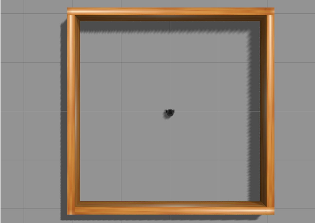
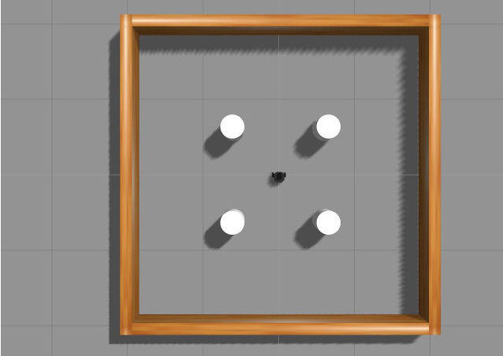
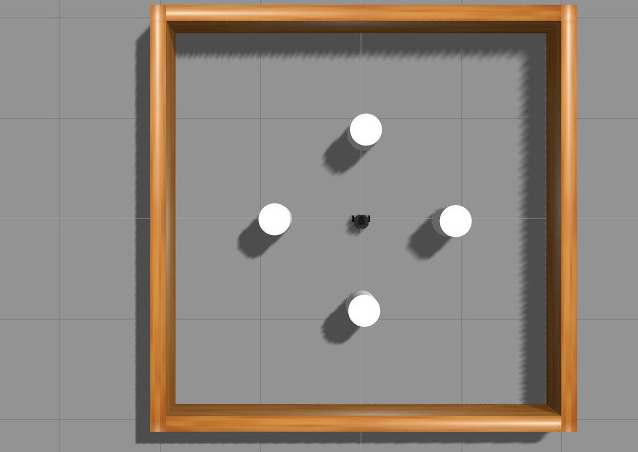
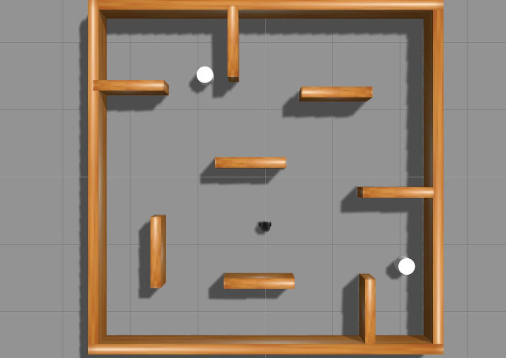

# 🔁 Reinforcement Learning com DQN (Deep-Q-Learning) no TurtleBot3

Este tutorial utiliza Aprendizado por Reforço, uma **técnica de Aprendizado de Máquina** onde o **TurtleBot3** aprende a agir por tentativa e erro, recebendo recompensas ou punições com base em suas ações, utilizando os pacotes padrão do ROS2.

O algoritmo usado é o **Deep Q-Learning (DQN)**, que combina redes neurais com aprendizado por reforço para ensinar o TurtleBot3 a tomar decisões eficazes em ambientes complexos e dinâmicos.

> **Importante:** Todos os comandos devem ser executados **dentro do container Docker**.

---

## 📦 1️⃣ Configuração Inicial

### **Passo 1: Iniciar o Container**
Caso ainda não esteja rodando:
```bash
./run.sh turtlebot3_ros2:latest
```
Caso precise abrir um novo terminal dentro do container:
```bash
docker exec -it turtlebot3_container bash
```
### **Passo 2: Definir o Modelo do TurtleBot3**
O modelo padrão é **`waffle`**, mas pode ser alterado antes da execução:
```bash
export TURTLEBOT3_MODEL=burger  # Opções: burger, waffle, waffle_pi
```
---

## 🧾 Definir parâmetros 

O objetivo do Agente DQN é fazer com que o TurtleBot3 alcance o objetivo evitando os obstáculos. Quando o TurtleBot3 se aproxima do destino, ele recebe uma recompensa positiva; quando se afasta, recebe uma recompensa negativa.

O episódio termina quando:

* o TurtleBot3 colide com um obstáculo
* Um determinado tempo limite é atingido.

Durante o episódio:

* O TurtleBot3 recebe uma grande recompensa positiva ao alcançar o objetivo.
* Uma grande punição negativa caso colida com um obstáculo.

## 📡 Definir Estado

O estado representa uma observação do ambiente, descrevendo a situação atual do TurtleBot3.
Neste caso, o state_size é 26, composto por:
* 24 valores do LDS (sensor de distância),
* distância até o objetivo, e
* ângulo até o objetivo.

Por padrão, o LDS do TurtleBot3 tem 360 amostras.
Você pode modificar essa amostragem desta forma no terminal:
```bash
nano /turtlebot3_simulations/turtlebot3_gazebo/models/turtlebot3_waffle/model.sdf
```

Procure por: 
```bash
<sensor name="hls_lfcd_lds" type="ray">    # Find the "hls_lfcd_lds"
  <visualize>true</visualize>    # Visualization of LDS. If you don't want to see LDS, set to `false`
``` 
```bash
<scan>
  <horizontal>
    <samples>360</samples>    # The number of sample. Modify it to 24
    <resolution>1.000000</resolution>
    <min_angle>0.000000</min_angle>
    <max_angle>6.280000</max_angle>
  </horizontal>
</scan>
```
## 🔢 Descrição dos estágios 
### 1. Estágio 1 (Sem obstáculo)
Estágio 1 é um mapa 4x4 sem obstáculo


### 2. Estágio 2 (Obstáculo estático)
Estágio 2 é um mapa 4x4 com 4 cilindros como obstáculos estáticos


### 3. Estágio 3 (Obstáculo móvel)
Estágio 3 é um mapa 4x4 com 4 cilindros como obstáculos móveis


### 4. Estágio 4 (Combinação de obstáculos)
Estágio 4 é um mapa 5x5 com paredes e 2 cilindros como obstáculos estáticos


## ▶️ Executar o Aprendizado de Máquina

### 🗺️ Carregar o Estágio no Mapa do Gazebo

Este comando carrega o ambiente de simulação correspondente ao estágio desejado:
```bash
ros2 launch turtlebot3_gazebo turtlebot3_dqn_{$stage_num}.launch.py
```

### 🌐 Executar o Nó do Ambiente no Gazebo

Este nó gerencia o ambiente no Gazebo. Ele reinicia a posição do TurtleBot3 e gera um novo objetivo sempre que um novo episódio começa:
```bash
ros2 run turtlebot3_dqn dqn_gazebo {$stage_num}
```

### 🧠 Executar o Nó do Ambiente DQN

Este nó calcula o estado do TurtleBot3 com base na simulação, além de determinar as recompensas, sucesso e falha em cada episódio:
```bash
ros2 run turtlebot3_dqn dqn_environment
```

### 🤖 Executar o Nó do Agente DQN

Este nó é responsável por treinar o TurtleBot3. Ele usa as recompensas calculadas para ajustar o comportamento do robô a cada episódio:

```bash
ros2 run turtlebot3_dqn dqn_agent {$stage_num} {$max_training_episodes}
```

### 🧪 Testar o Modelo Treinado

Após o treinamento, você pode testar o modelo treinado substituindo o agente pelo nó de teste:
```bash
ros2 run turtlebot3_dqn dqn_test {$stage_num} {$load_episode}
```

## 📊 Vizualizar o Gráfico de Aprendizado de Máquina
### 🏆 Gráfico de Ações

O gráfico de ações mostra a ação atual do TurtleBot3, as recompensas obtidas e o total de recompensas durante o episódio.
```bash
ros2 run turtlebot3_dqn action_graph
```

### 📈 Gráfico de Resultados

O gráfico de resultados é um gráfico linear que mostra a média dos valores máximos do Q-Value e a recompensa total conforme o episódio progride.
```bash
ros2 run turtlebot3_dqn result_graph
```

## 📚 Referências
- [TurtleBot3 - Machine Learning](https://emanual.robotis.com/docs/en/platform/turtlebot3/machine_learning/#machine-learning)

---