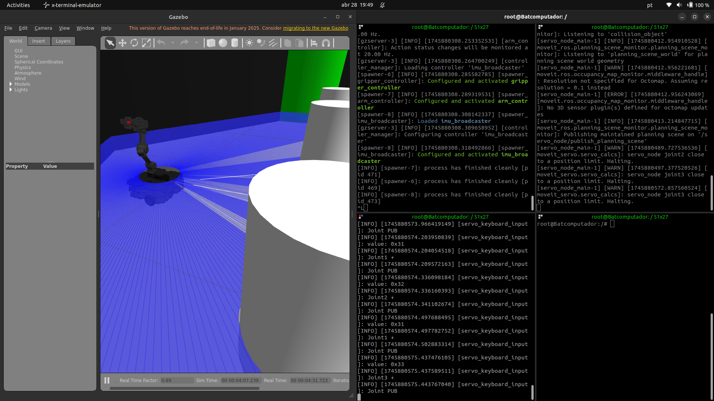
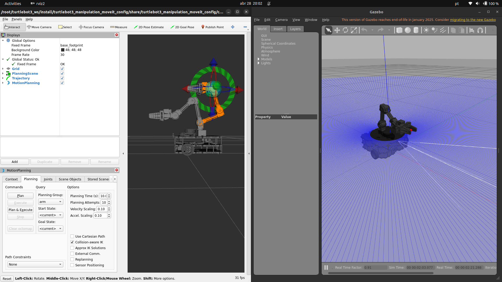
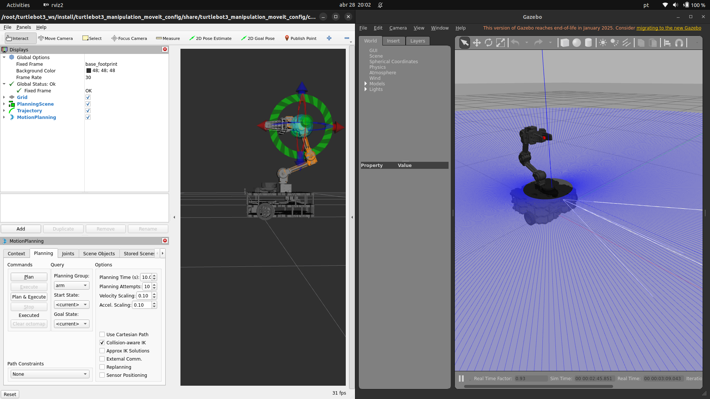

# 🤖💪 Manipulador robótico com o TurtleBot3

Este tutorial ensina como **Rodar a stack de manipulação** do **TurtleBot3** usando os pacotes de manipulador do **TurtleBot3**

> **Importante:** Todos os comandos devem ser executados **dentro do container Docker**.
---

## 📦 1️⃣ Configuração Inicial

### **Iniciar o Container**
Caso ainda não esteja rodando:
```bash
./run.sh turtlebot3_ros2:latest
```
Caso precise abrir um novo terminal dentro do container:
```bash
docker exec -it turtlebot3_container bash
```

## 🦾 2️⃣ Simulação do Braço Robótico

### **Passo 1: Inicializar a Simulação do Braço**
Execute o seguinte comando para iniciar a simulação do braço robótico:
```bash
ros2 launch turtlebot3_manipulation_bringup gazebo.launch.py
```

### **Passo 2: Verificar a Simulação**
Confirme que a simulação do braço está funcionando corretamente verificando os tópicos disponíveis:
```bash
ros2 topic list
```

### **Passo 3: Controlar o braço**
Temos que lançar o nó de servos com o moveit em outro terminal:
```bash
ros2 launch turtlebot3_manipulation_moveit_config servo.launch.py
```

Após isso lançar o nó de teleoperação pelo teclado:
```bash
ros2 run turtlebot3_manipulation_teleop turtlebot3_manipulation_teleop
```
*sem movimentar as juntas com os servos*


*depois de movimentar as juntas com os servos*



## 🛠️ 3️⃣ Manipulação com o MoveIt

### **Passo 1: Configurar o MoveIt**
Para utilizar o MoveIt com o manipulador do TurtleBot3, inicie o seguinte comando:
```bash
ros2 launch turtlebot3_manipulation_moveit_config moveit_gazebo.launch.py
```

### **Passo 2: planejar e executar posições**
Para a parte de planejamento e execução de poses, modificar a pose do manipulador pelo Rviz e ir em *planejar e executar*

*antes de mandar planejar e executar*



*depois de mandar planejar e executar*



## 🗺️ 4️⃣ Mapeamento e Navegação com o Manipulador

### **Passo 1: Inicializar o SLAM**
Para realizar o mapeamento do ambiente, inicie o SLAM com o seguinte comando:
```bash
ros2 launch turtlebot3_cartographer cartographer.launch.py use_sim_time:=true
```

### **Passo 2: Salvar o Mapa**
Após explorar o ambiente e criar o mapa, salve-o com o comando:
```bash
ros2 run nav2_map_server map_saver_cli -f /root/shared_folder/{nome_do_mapa}
```

### **Passo 3: Navegação Autônoma**
Para realizar a navegação autônoma com o manipulador, inicie o sistema de navegação:
```bash
ros2 launch turtlebot3_navigation2 navigation2.launch.py use_sim_time:=true map:=/root/shared_folder/{nome_do_mapa}.yaml
```

### **Passo 4: Controlar o Manipulador Durante a Navegação**
Enquanto o TurtleBot3 navega, você pode controlar o manipulador para realizar tarefas específicas. Certifique-se de que o nó de controle do manipulador está ativo:
```bash
ros2 launch turtlebot3_manipulation_moveit_config servo.launch.py
```

*Ou caso tenha iniciado a simulação para controle com o moveit, é só fazer aquele planejamento e execução de pose*

Agora, você pode alternar entre a navegação e o controle do manipulador para realizar operações complexas.


