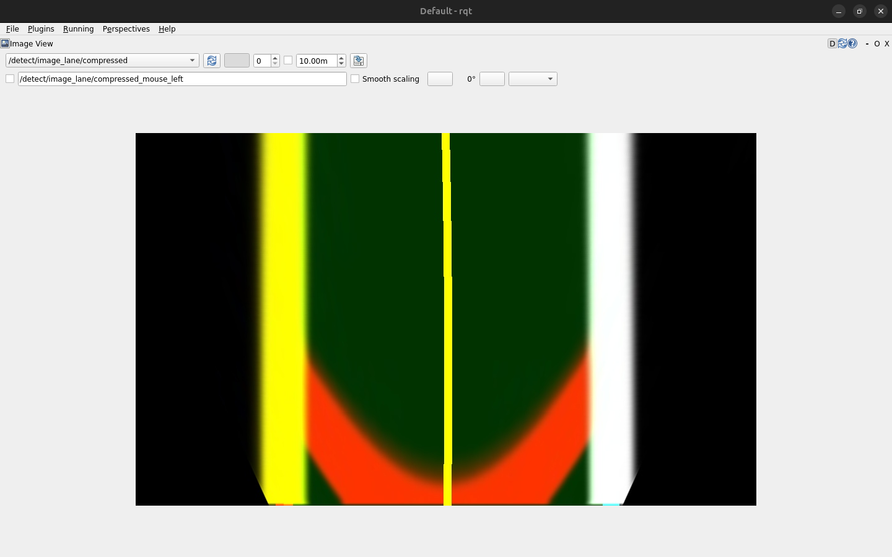
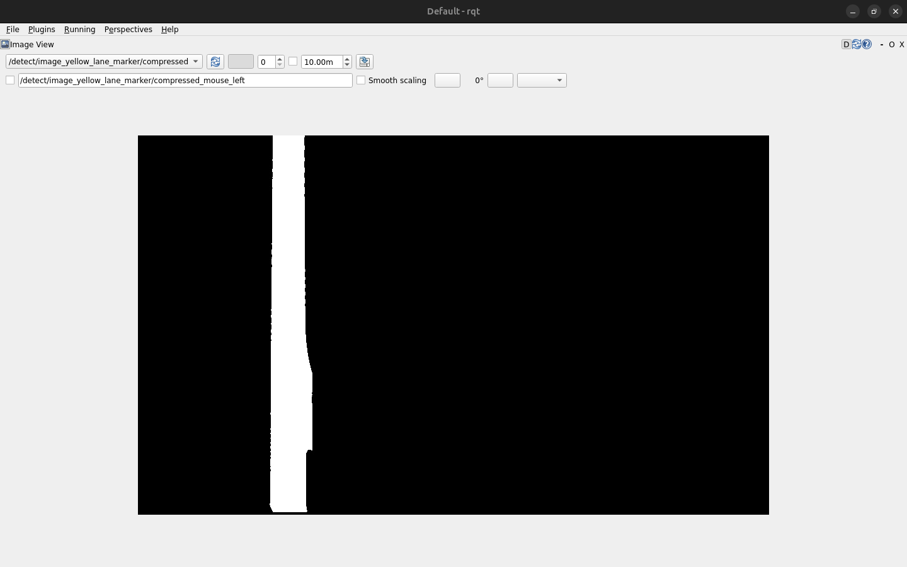
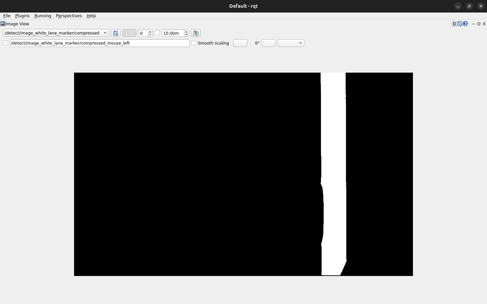
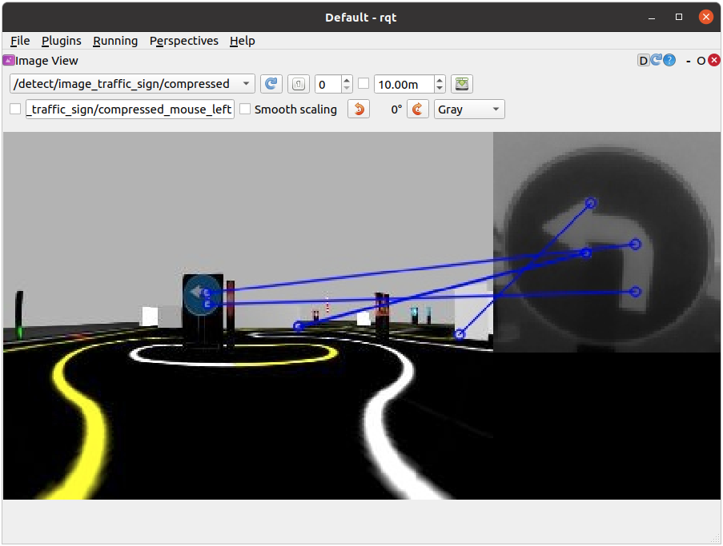
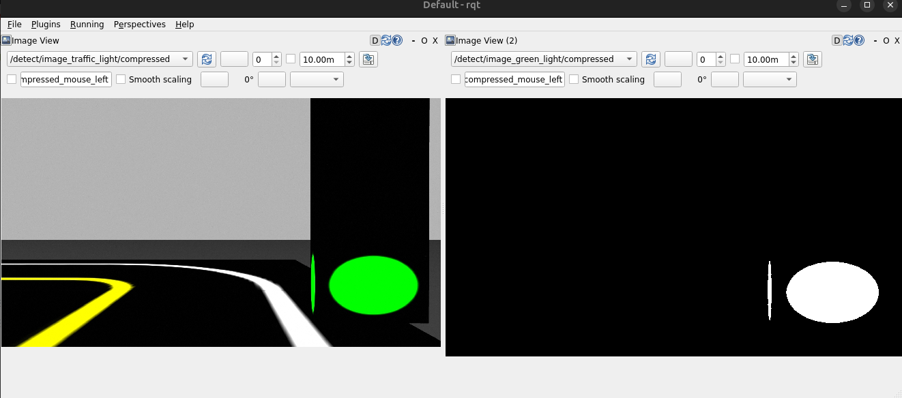

# 🏎️ Direção autonoma no turtlebot3

Este tutorial ensina como usar os pacotes de **direção autônoma** com o TurtleBot3, incluindo **detecção de faixa, semáforos e controle autônomo do robô**.

> **Importante:** Todos os comandos devem ser executados **dentro do container Docker**.
---

## 📦 1️⃣ Configuração Inicial

### **Passo 1: Iniciar o Container**
Caso ainda não esteja rodando:
```bash
./run.sh turtlebot3_ros2:latest
```
Caso precise abrir um novo terminal dentro do container:
```bash
docker exec -it turtlebot3_container bash
```
### **Passo 2: Definir o Modelo do TurtleBot3**
O modelo padrão é **`waffle`**, mas nesse tutorial iremos utilizar o **`burger_cam`**:
```bash
export TURTLEBOT3_MODEL=burger_cam 
```
---

## 🤖2️⃣ Definindo o Modelo do TurtleBot3

Adicione também esta linha ao seu ~/.bashrc, pois o Autorace só é compatível com o modelo burger_cam:
```bash
export TURTLEBOT3_MODEL=burger_cam
```


## 🌍3️⃣ Simulação do Ambiente de Direção
#### Inicie a simulação no Gazebo com um curso pré-definido de acompanhamento de faixa.
```bash
ros2 launch turtlebot3_gazebo turtlebot3_autorace_2020.launch.py
```

#### Em seguida, execute os processos de calibração da câmera, que garantem que as faixas detectadas sejam mapeadas com precisão na perspectiva do robô:
```bash
ros2 launch turtlebot3_autorace_camera intrinsic_camera_calibration.launch.py
```

```bash
ros2 launch turtlebot3_autorace_camera extrinsic_camera_calibration.launch.py
```
Esses passos ativam a calibração intrínseca e extrínseca para corrigir distorções no sinal da câmera.

#### Por fim, inicie o nó de detecção de faixas em modo de calibração para começar a detectar as faixas:
```bash
ros2 launch turtlebot3_autorace_detect detect_lane.launch.py calibration_mode:=True
```

### 📷 Visualizando a Saída da Detecção de Faixas

Para inspecionar as faixas detectadas, abra o rqt:
```bash
rqt
```
Em seguida, navegue até o menu: Plugins > Visualization > Image View
Abra três visualizadores de imagem para exibir os diferentes resultados da detecção de faixas, como:
- /detect/image_lane/compressed
 
- /detect/image_yellow_lane_marker/compressed
 
- /detect/image_white_lane_marker/compressed
 

### 🏎️ Executando o Acompanhamento de Faixas
#### Após a conclusão da calibração, reinicie o nó de detecção de faixas sem a opção de calibração:

```bash
ros2 launch turtlebot3_autorace_detect detect_lane.launch.py
```

#### Em seguida, inicie o nó de controle de acompanhamento de faixas. Ele permite que o TurtleBot3 siga automaticamente as faixas detectadas:
```bash
ros2 launch turtlebot3_autorace_mission control_lane.launch.py
```
### 3️⃣🚦 Detecção de Placas de Trânsito

#### Iniciando o Nó de Detecção de Placas
Para detectar placas de trânsito, inicie o nó de detecção com o seguinte comando:
```bash
ros2 launch turtlebot3_gazebo turtlebot3_autorace_2020.launch.py
```

#### Rodando o teleop do turtlebot3
```bash
ros2 run turtelbot3_teleop teleop_keyboard
```

#### Visualizando as Placas Detectadas
Abra o rqt para inspecionar as placas de trânsito detectadas:
```bash
rqt
```
No menu, vá para: Plugins > Visualization > Image View. Adicione um visualizador de imagem para exibir o tópico:
- `/detect/image_traffic_sign/compressed`

#### Configurando o Reconhecimento de Placas
Rode a calibração de câmera
```bash
ros2 launch turtlebot3_autorace_camera intrinsic_camera_calibration.launch.py
```
```bash
ros2 launch turtlebot3_autorace_camera extrinsic_camera_calibration.launch.py

```
#### Iniciando o reconhecimento da missão determinada
```bash
ros2 launch turtlebot3_autorace_detect detect_sign.launch.py mission:={SELECT_MISSION}

```

Defina a missão substituindo `{SELECT_MISSION}` por uma das alternativas a seguir: intersection, construction, parking, level_crossing, tunnel

#### Visualizando o teste
Para a visualização da detecção use o rqt e observe a câmera enquanto controla o turtlebot3 pelo teleop

exemplo: 


### 4️⃣🚦 Detecção de Semáforos

#### Processo de Detecção de Semáforos
1. Filtragem da Imagem:

- A imagem capturada pela câmera é filtrada para extrair máscaras de cores específicas: vermelho, amarelo e verde.

2. Localização do Círculo na Região de Interesse (RoI):

- Para cada máscara de cor, o algoritmo localiza círculos na região de interesse (RoI), onde os semáforos são esperados.

3. Identificação das Luzes do Semáforo:

- O sistema identifica as luzes do semáforo na seguinte ordem: vermelho, amarelo e verde.

#### Configuração e Execução da Detecção de Semáforos
1. Inicie a simulação do Autorace no Gazebo: Abra um terminal e execute o seguinte comando:
```bash
ros2 launch turtlebot3_gazebo turtlebot3_autorace_2020.launch.py
```

2. Execute o nó de calibração intrínseca: Abra um novo terminal e execute:
```bash
ros2 launch turtlebot3_autorace_camera intrinsic_camera_calibration.launch.py
```

3. Execute o nó de calibração extrínseca: Abra outro terminal e execute:
```bash
ros2 launch turtlebot3_autorace_camera extrinsic_camera_calibration.launch.py
```

4. Inicie o nó de detecção de semáforos com a opção de calibração: Abra um novo terminal e execute:
```bash
ros2 launch turtlebot3_autorace_detect detect_traffic_light.launch.py 
```

5. Visualize os resultados no rqt: Abra o rqt em um terminal:
```bash
rqt
```

#### No menu do rqt, vá para:

Plugins > Visualization > Image View.  
Crie duas janelas de visualização de imagem.

1. Na primeira janela, selecione o tópico:  
    - `/detect/image_traffic_light/compressed`  
      Para visualizar a imagem processada com os semáforos detectados.

2. Na segunda janela, selecione um dos seguintes tópicos para visualizar as máscaras de cores:  
    - `/detect/image_red_light`  
    - `/detect/image_yellow_light`  
    - `/detect/image_green_light`  
    - `/detect/image_traffic_light`

Exemplo para luz verde:

